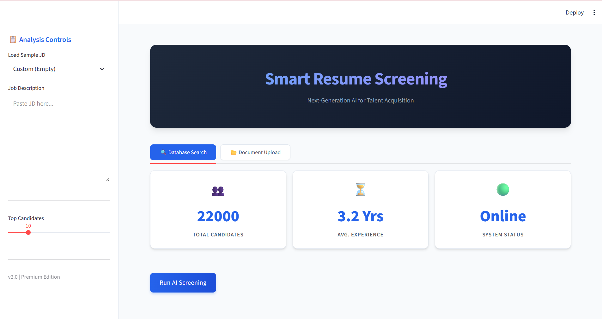

# Resume / Candidate Screening System

This is a Machine Learning based Resume Screening System that ranks candidates from a CSV database based on a user-provided Job Description using TF-IDF and Cosine Similarity.

## Features
- **Dual Mode Interface**:
    - **Search Database**: Rank candidates from `data/resumes.csv`.
    - **Upload Resumes**: Upload and screen PDF resumes instantly.
- **Text Cleaning**: Preprocesses text using spaCy (removes stopwords, lemmatization).
- **Skill Extraction**: Identifies key technical skills from job descriptions and resumes.
- **Ranking**: Ranks candidates based on relevance to the input Job Description.
- **Skill Gap Analysis**: Highlights missing skills for each candidate.
- **Enhanced UI**: Interactive charts, metrics, and detailed analysis views.

## Installation

1.  Clone the repository or download the files.
2.  Install the required dependencies:
    ```bash
    pip install -r requirements.txt
    ```
3.  Download the spaCy language model:
    ```bash
    python -m spacy download en_core_web_sm
    ```

## Usage

1.  Run the Streamlit application:
    ```bash
    streamlit run app.py
    ```
2.  The application will open in your browser.
3.  The system automatically loads the candidate database.
4.  Paste a **Job Description** in the sidebar.
5.  Click **"Screen Candidates"** to see the ranking and analysis.
6.  Adjust the slider to view more or fewer top candidates.

## Project Structure
- `app.py`: Main Streamlit application.
- `utils.py`: Helper functions for text processing and analysis.
- `requirements.txt`: List of dependencies.
- `data/`: Directory containing `resumes.csv`.

## Technologies Used
- **Python**
- **Streamlit**
- **spaCy**
- **Scikit-learn**
- **Pandas**

📸 Application Screenshot

